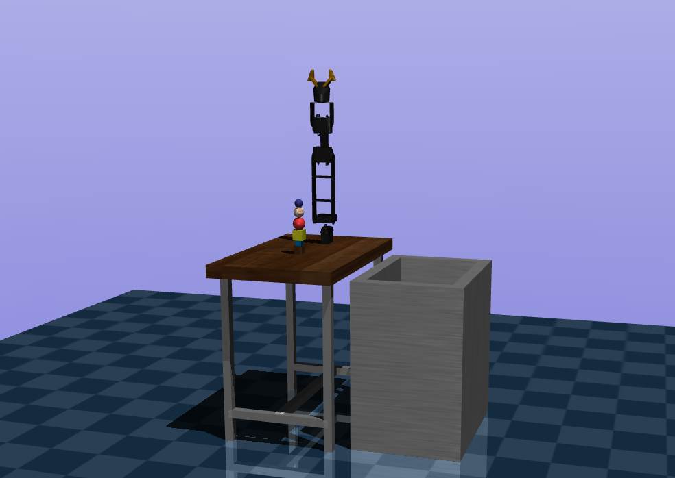

# Robot Arm

This repository is all about the robotic arm and contains the following divisions in it.

## Robotic-Arm Simulation
Which is built on the Mujoco physics engine. Mujoco is a powerful and flexible physics engine that can be used to simulate a wide range of robotic systems, including arms, legs, and other complex mechanisms.

Included Gripper mesh along with the servo motor mesh for making it more realistic in design.

## Gripper
In the Gripper module, I've included 4-DOF `Robotic-arm` which has two fingers to hold the objects. Along with arm, there are some random objects for testing and a `drop-box` for dropping those objects after successful grasping.

Gripper Module also, has a controller code, with which you can control the `Robotic-arm` using the keyboard. Which is then adds up with a Reinforcement learning agent to learn on it's own for grasping the things and putting down in the `drop-box` mentioned before.

## Motors
In addition to the simulation code, this repository also contains code related to servo motor controllers. Servo motors are commonly used in robotic arm systems to provide precise control over the arm's movements.

## Drivers
Finally, this repository contains code related to the SC08A controller and L298N driver. These components are used to control the motors and interface with other hardware components, such as sensors and switches.